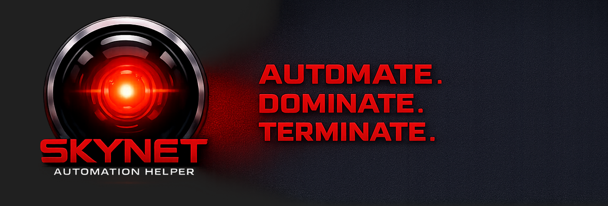
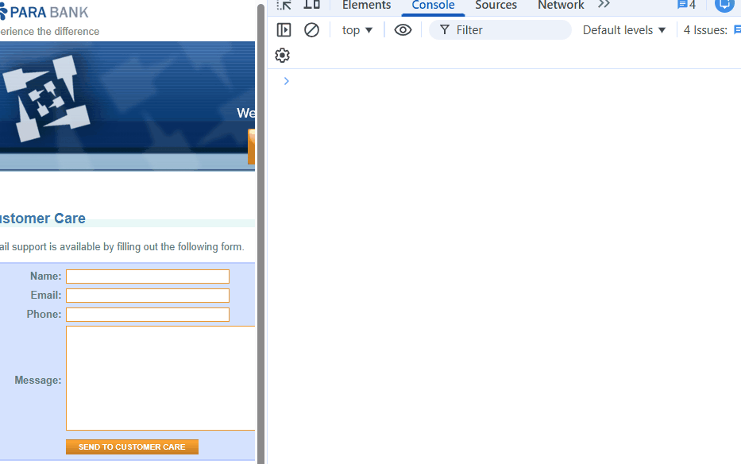
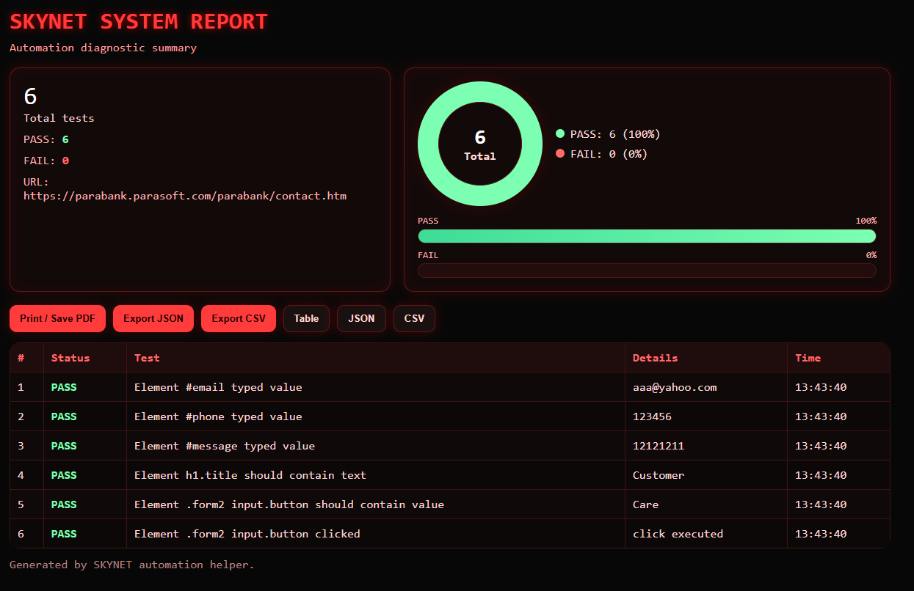

# SKYNET QA Automation Helper

  

## What is SKYNET?

SKYNET is a lightweight browser automation helper that lets you run UI tests instantly — directly from the browser console or a bookmarklet.

No installation. No frameworks. Just run.

---
## Demo

  <b>Run UI tests instantly from your browser</b>

  

---
## Features

- DOM interaction helpers
- Assertions for text and values
- Checkbox validation
- Table data validation
- Test result tracking
- Visual report generation
- PASS / FAIL charts
- Export results to JSON and CSV
- Terminator-style HUD interface
- Wait for element helper
- Recording mode for generating tests
- Screenshot support for failed assertions
- Element highlighting

---

## Quick Start

### 1. Install dependencies

~~~bash
npm install
~~~

### 2. Build the bookmarklet

~~~bash
npm run build
~~~

This command will generate:

~~~text
dist/skynet.min.js
dist/skynet.bookmarklet.txt
~~~

### 3. Copy the bookmarklet

Open:

~~~text
dist/skynet.bookmarklet.txt
~~~

Copy the entire contents of the file.

### 4. Add it to your browser

Create a new bookmark in your browser and paste the contents of `dist/skynet.bookmarklet.txt` into the **URL** field.

### 5. Run SKYNET

Open your web application and click the bookmark.

SKYNET will load and you can run commands directly from the browser console.

---

## Limitations & Notes

SKYNET is optimized for fast, lightweight UI testing directly in the browser.

### Best used with
- Single Page Applications (SPA)
- Modern frontend frameworks (React, Angular, Vue)
- Debugging and exploratory testing workflows

### Keep in mind
- Page reloads will reset SKYNET (as it runs in-browser)
- Dynamic content may require `waitFor`
- SKYNET is not a replacement for full E2E frameworks like Cypress or Playwright

### Tip

If elements are not found immediately, use:

~~~javascript
await skynet.waitFor('#selector') 
~~~

## Example

~~~javascript
async function loginTest() {
  await skynet.waitFor('#email');

  skynet.get('#email').type('test@test.com');

  await skynet.get('#terms').shouldBeTrue();

  await skynet.get('h1').shouldContainText('Dashboard');

  skynet.report();
}

loginTest();
~~~

  

---
## API

### Element Selection

#### `skynet.get(selector)`

Selects a DOM element and returns an automation helper object.

Example:

~~~javascript
skynet.get('#email')
~~~

---

### Element Actions

#### `skynet.get(selector).click()`

Clicks the selected element.

~~~javascript
skynet.get('#loginButton').click()
~~~

#### `skynet.get(selector).type(value)`

Types a value into an input field.

~~~javascript
skynet.get('#email').type('test@test.com')
~~~

#### `skynet.get(selector).highlight()`

Highlights an element visually in the browser.

~~~javascript
skynet.get('#email').highlight()
~~~

---

### Text Assertions

#### `await skynet.get(selector).shouldContainText(text)`

Checks whether the element contains the given text.

~~~javascript
await skynet.get('h1').shouldContainText('Dashboard')
~~~

#### `await skynet.get(selector).shouldHaveText(text)`

Checks whether the element text exactly matches the expected value.

~~~javascript
await skynet.get('#message').shouldHaveText('Success')
~~~

---

### Value Assertions

#### `await skynet.get(selector).shouldContainValue(value)`

Checks whether an input contains a value.

~~~javascript
await skynet.get('#email').shouldContainValue('@test.com')
~~~

#### `await skynet.get(selector).shouldHaveValue(value)`

Checks whether an input value exactly matches the expected value.

~~~javascript
await skynet.get('#email').shouldHaveValue('test@test.com')
~~~

---

### Checkbox Assertions

#### `await skynet.get(selector).shouldBeChecked(true|false)`

Checks checkbox state.

~~~javascript
await skynet.get('#terms').shouldBeChecked(true)
~~~

#### `await skynet.get(selector).shouldBeTrue()`

Shortcut for checked = true.

~~~javascript
await skynet.get('#terms').shouldBeTrue()
~~~

#### `await skynet.get(selector).shouldBeFalse()`

Shortcut for checked = false.

~~~javascript
await skynet.get('#terms').shouldBeFalse()
~~~

---

### Table Validation

#### `await skynet.table(selector).shouldMatchData(data)`

Checks if a table matches expected data.

~~~javascript
await skynet.table('#users').shouldMatchData([
  ['Petros', 'Admin'],
  ['Plak', 'User']
])
~~~

#### `skynet.table(selector).highlight()`

Highlights a table visually.

~~~javascript
skynet.table('#users').highlight()
~~~

---

### Wait Helpers

#### `await skynet.waitFor(selector, timeout, interval)`

Waits until an element appears in the DOM.

~~~javascript
await skynet.waitFor('#email')
~~~

Custom timeout:

~~~javascript
await skynet.waitFor('#email', 8000, 100)
~~~

---

### Reporting

#### `skynet.report()`

Opens the SKYNET visual HTML report in a new tab.

~~~javascript
skynet.report()
~~~

#### `skynet.exportJSON()`

Exports test results as JSON.

~~~javascript
skynet.exportJSON()
~~~

#### `skynet.exportCSV()`

Exports test results as CSV.

~~~javascript
skynet.exportCSV()
~~~

#### `skynet.clearResults()`

Clears the stored test results.

~~~javascript
skynet.clearResults()
~~~

---

### Recording Mode

#### `skynet.startRecording()`

Starts recording user interactions.

~~~javascript
skynet.startRecording()
~~~

#### `skynet.stopRecording()`

Stops recording.

~~~javascript
skynet.stopRecording()
~~~

#### `skynet.exportRecordedTest()`

Exports recorded actions as a JavaScript test.

~~~javascript
skynet.exportRecordedTest()
~~~

#### `await skynet.copyRecordedTest()`

Copies generated test to clipboard.

~~~javascript
await skynet.copyRecordedTest()
~~~

#### `skynet.recordedActions`

Access the recorded actions array.

~~~javascript
console.log(skynet.recordedActions)
~~~

---

### Screenshot Support

#### `await skynet.loadScreenshotSupport()`

Loads screenshot support dynamically using `html2canvas`.

~~~javascript
await skynet.loadScreenshotSupport()
~~~

---

## Example Workflow

~~~javascript
async function testFlow() {
  await skynet.loadScreenshotSupport();

  await skynet.waitFor('#email');

  skynet.get('#email')
    .highlight()
    .type('test@test.com');

  await skynet.get('#terms').shouldBeTrue();

  await skynet.get('h1').shouldContainText('Dashboard');

  skynet.report();
}

testFlow();
~~~

---

## Changelog

See [CHANGELOG.md](./CHANGELOG.md)

---

## License

MIT